---
aliases:
- Character Insertion
author:
- TakamiChie
author_page: https://github.com/TakamiChie
categories: []
description: Plugin to insert a specified symbol under the cursor
downloads: 3576
funding_page: https://www.buymeacoffee.com/TakamiChie
mobile: true
number: 864
title: Character Insertion
type: plugin
updated: '2023-04-02T14:51:28'
url: https://github.com/TakamiChie/Obsidian_CharacterInsertionPlugin
version: 1.0.0
---

%% README_START %%

# Character Insertion Plugin

A plug-in that inserts a specified character in advance at the cursor position.


Insert the character set in advance in the cursor position in the settings.

For example, if the value of the specified "input charactor" is the following value...

```
⭐
🔶
👍
```

Each time the command is executed, the following characters are inserted / deleted in the cursor position.

```mermaid
flowchart LR
  A[Without letters] --> B["⭐"]
  B --> C["🔶"]
  C --> D["👍"]
  D --> E["No text <br> (deleted 👍)"]
```



## When to use it?

The author creates a diary with Obsidian.

In the diary, each line marked each line with emoticons, but I felt it was troublesome to copy the mark and paste it to the necessary parts.

Similarly.If you want to mark the markdown documents with fixed rules, I think this plugin will be useful.

%% README_END %%